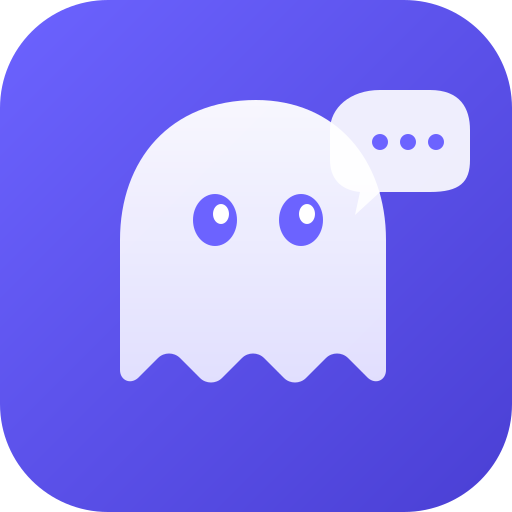

<p align="center">
  
</p>

<h1 align="center">Specter Chat</h1>

<p align="center">
  A lightweight, cross-platform desktop chat client with MCP (Model Context Protocol) support.<br>
  Built with Flutter.
</p>

<p align="center">
  
  
  
</p>

---

Specter connects to any OpenAI-compatible API (Ollama, LM Studio, vLLM, llama.cpp server, etc.) and lets you interact with MCP servers to extend your model's capabilities with external tools.

## Why Specter?

Existing chat clients fail at one critical thing: when an MCP tool returns an image, they either don't display it or don't forward it to the model. Specter solves this — images from MCP tools are rendered inline **and** sent back to the model as base64 so it can actually see them.

## Features

- **3-panel layout** — conversation list, chat area, and settings sidebar
- **Streaming responses** with real-time token display and stop button
- **Markdown rendering** with syntax-highlighted code blocks
- **Thinking/reasoning display** — collapsible chain-of-thought blocks
- **MCP integration** via Streamable HTTP — connect to multiple servers, discover tools, execute them
- **Image handling** — MCP `ImageContent` displayed inline and forwarded to the model
- **Tool call display** — tool name, arguments (collapsible JSON), and results
- **Full generation controls** — temperature, top-p, top-k, max tokens, penalties
- **Local storage** — chat history and settings persisted in SQLite
- **Dark theme** by default

## Requirements

### macOS (primary target)
- macOS 13+
- [Flutter SDK](https://docs.flutter.dev/get-started/install/macos/desktop) 3.29+
- Xcode 15+ (with command-line tools)

### Linux (via DevContainer)
- Docker
- VS Code with the Dev Containers extension

## Getting Started

### macOS

```bash
git clone https://github.com/YV17labs/specterchat.git
cd specterchat
flutter pub get
dart run build_runner build --delete-conflicting-outputs
flutter run -d macos
```

### Linux (DevContainer)

1. Open in VS Code and select **"Reopen in Container"** when prompted.
2. The DevContainer will automatically install Flutter and run code generation.
3. Run the app:
   ```bash
   flutter run -d linux
   ```

## Development Workflow

### Running the app in dev mode

```bash
flutter run -d macos
```

Once running, the terminal offers interactive commands:

| Key | Action |
|-----|--------|
| `r` | **Hot reload** — applies code changes in ~1s, preserves app state (current conversation, settings) |
| `R` | **Hot restart** — full restart, resets app state |
| `q` | Quit |

**VS Code**: press F5 (or Run > Start Debugging) and hot reload happens automatically on every save (Cmd+S).

### When to use what

| What you changed | What to do |
|------------------|------------|
| Widget, provider, service | Save the file, press `r` (or just Cmd+S in VS Code) |
| Freezed model or Drift schema | Run `dart run build_runner build --delete-conflicting-outputs`, then press `R` |
| `pubspec.yaml` (new dependency) | Run `flutter pub get`, then quit and re-run `flutter run -d macos` |
| Native code (macOS/Swift) | Quit and re-run `flutter run -d macos` |

### Common commands

```bash
# Install dependencies
flutter pub get

# Run code generation (after modifying models or database schema)
dart run build_runner build --delete-conflicting-outputs

# Watch mode — auto-regenerates on file changes (useful during model work)
dart run build_runner watch --delete-conflicting-outputs

# Run all tests
flutter test

# Run database tests only
flutter test test/database/

# Build release (macOS)
flutter build macos --release

# Build release (Linux)
flutter build linux --release
```

## Database & Migrations

Specter uses **Drift** (SQLite ORM) with a versioned migration strategy.

- Schema version history and migration steps are documented in `CLAUDE.md`
- Foreign key constraints are enforced at runtime (`PRAGMA foreign_keys = ON`)
- When modifying the database schema, follow **all** steps in order:
  1. Update table definitions in `lib/database/database.dart`
  2. Increment `schemaVersion`
  3. Add a migration step in `onUpgrade` (and update `onCreate` if needed)
  4. Regenerate Drift code:
     ```bash
     dart run build_runner build --delete-conflicting-outputs
     ```
  5. Export the new schema snapshot:
     ```bash
     dart run drift_dev schema dump lib/database/database.dart drift_schemas/
     ```
  6. Regenerate migration test helpers:
     ```bash
     dart run drift_dev schema generate --data-classes --companions \
       drift_schemas/ test/database/generated_migrations/
     ```
  7. Add a migration test in `test/database/migration_test.dart` (verify data preservation)
  8. Run all database tests:
     ```bash
     flutter test test/database/
     ```

## Usage

1. Start your LLM server (Ollama, LM Studio, etc.)
2. In the right sidebar, set the **Base URL** (e.g. `http://localhost:1234/v1`)
3. Click the refresh button to load available models and select one
4. Optionally add MCP servers (name + URL) and connect to them
5. Create a new conversation and start chatting

## License

Proprietary. Copyright (c) 2026 Yoann Vanitou / YV17Labs. All rights reserved. See [LICENSE](LICENSE) for details.
