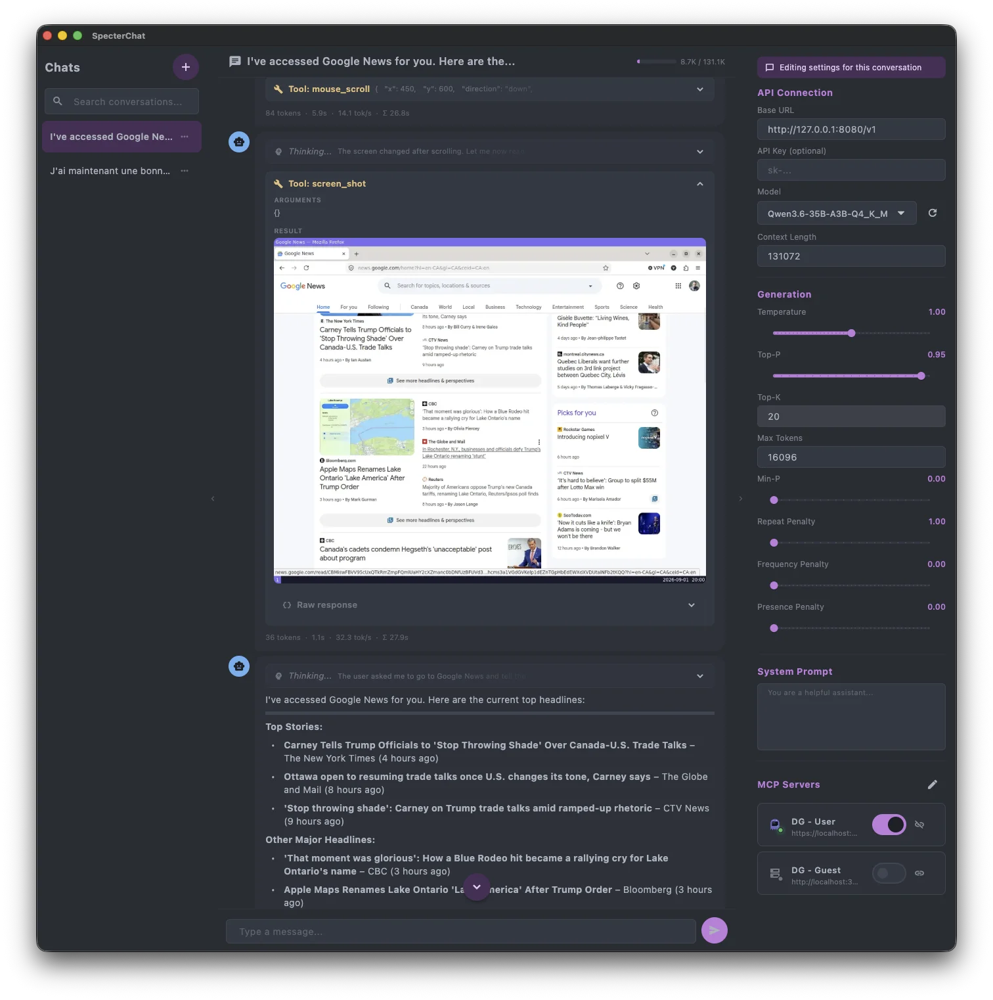
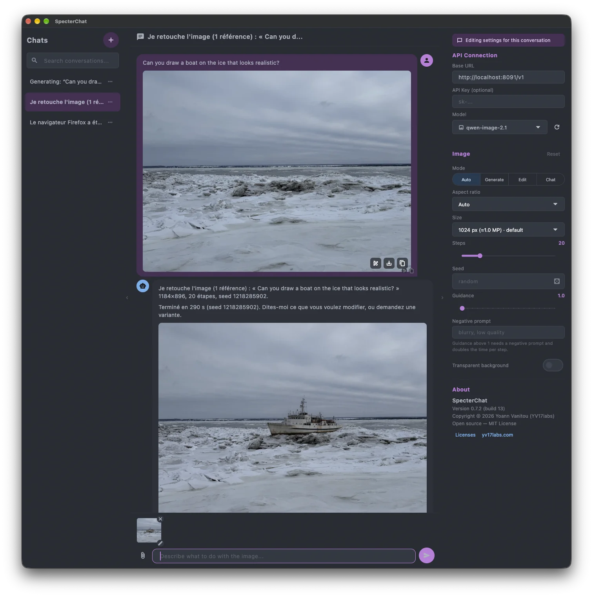
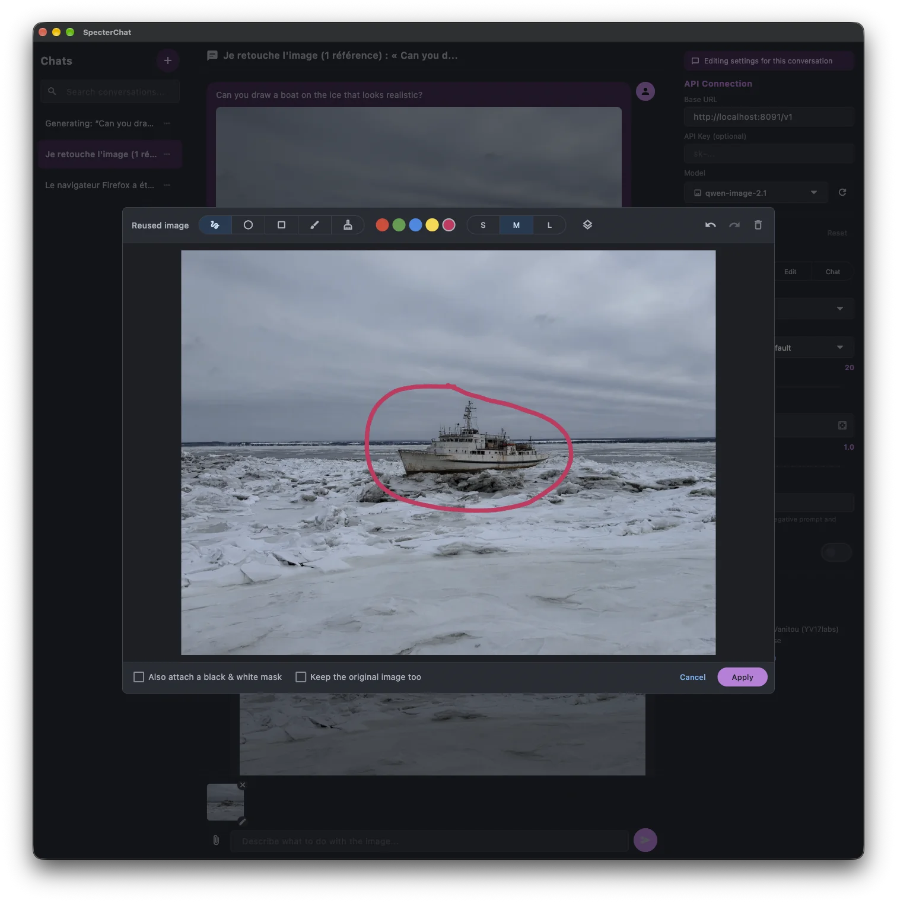

<p align="center">
  
</p>

<h1 align="center">SpecterChat</h1>

<p align="center">
  A lightweight, cross-platform desktop chat client with MCP (Model Context Protocol) support and image generation.<br>
  Built with Flutter.
</p>

<p align="center">
  
  
  
</p>

<p align="center">
  
</p>

---

SpecterChat connects to any OpenAI-compatible API (Ollama, LM Studio, vLLM, llama.cpp server, etc.) and lets you interact with MCP servers to extend your model's capabilities with external tools.

## Why SpecterChat?

Existing chat clients fail at one critical thing: when an MCP tool returns an image, they either don't display it or don't forward it to the model. SpecterChat solves this — images from MCP tools are rendered inline **and** sent back to the model as base64 so it can actually see them.

## Generate and edit images

<p align="center">
  
  
</p>

Select an image model and the same conversation becomes an image studio.
Ask for a picture and it streams back inline with a progress bar; attach one
of your own (file picker, drag-and-drop or paste) and the model edits it.
Every generated image is re-sent as the reference on the next turn, so
*"now make it blue"* just works.

To change one region, open the built-in **annotation editor** from any image
in the conversation, circle what should change and name the colour in your
prompt — *"in the red area, …"*. Pen, ellipse, rectangle, mask brush and
eraser, five colours, three stroke widths, undo/redo; optionally attach a
black-and-white mask and the untouched original alongside. The **Image**
panel exposes mode (auto / generate / edit / chat), aspect ratio, size,
steps, seed, guidance, negative prompt and transparent background — as a
global default or per conversation.

Image models are discovered from the server's `GET /models` (entries tagged
`generation.kind = "image"`) and images come back in the OpenRouter
`images[]` convention. The reference server is
[Pictor](https://github.com/YV17labs/Pictor), an OpenAI-compatible gateway
for local image models (Apple Silicon and NVIDIA); the screenshots show
Qwen-Image 2.1 served by it.

## Features

- **3-panel layout** — conversation list, chat area, and settings sidebar
- **Streaming responses** with real-time token display and stop button
- **Markdown rendering** with monospace code blocks
- **Thinking/reasoning display** — collapsible chain-of-thought blocks
- **MCP integration** via Streamable HTTP — connect to multiple servers, discover tools, execute them
- **Image handling** — MCP `ImageContent` displayed inline and forwarded to the model
- **Image generation** — select an image model, prompt for a picture, watch it stream in with a progress bar
- **Image editing** — attach a reference (file, drag-and-drop or paste) or reuse any image in the conversation; generated images are re-sent on the next turn so follow-up edits just work
- **Annotation editor** — circle, box or mask a region, name the colour in the prompt, optionally attach a black-and-white mask
- **Image settings** — mode, aspect ratio, size, steps, seed, guidance, negative prompt, transparent background; global default or per conversation
- **Tool call display** — tool name, arguments (collapsible JSON), and results
- **Full generation controls** — temperature, top-p, top-k, max tokens, penalties
- **Local storage** — chat history and settings persisted in SQLite
- **Dark theme** by default

## Download

Prebuilt installers for each tagged release are on the
[Releases](https://github.com/YV17labs/specterchat/releases) page:

| Platform | Minimum version | File |
|----------|-----------------|------|
| macOS | 12 (Monterey) | `SpecterChat-<version>-macos-universal.dmg` (Intel + Apple Silicon) |
| Windows | 10 | `SpecterChat-<version>-windows-x64-setup.exe` |
| Linux | Ubuntu 22.04 / Debian 12 | `SpecterChat-<version>-linux-x86_64.AppImage` or `…-linux-amd64.deb` |

### The binaries are not signed yet

We have not paid for an Apple Developer Program membership ($99/year), so the
macOS build is only *ad-hoc* signed — no Developer ID certificate, no
notarisation. Gatekeeper cannot ask Apple whether the app is safe, so the first
launch is blocked with *"Apple could not verify SpecterChat.app is free of
malware"*. Nothing is wrong with the download; it is what an unnotarised app
looks like.

To run it anyway, strip the quarantine attribute the browser attached:

```bash
xattr -dr com.apple.quarantine /Applications/SpecterChat.app
```

Alternatively, open it once, then go to **System Settings → Privacy & Security**
and click **Open Anyway**. On macOS 15+ the right-click → **Open** trick no
longer works — the dialog only offers *Move to Trash* / *Done*.

On Windows, the installer is unsigned too: click **More info → Run anyway** at
the SmartScreen prompt.

## Building from Source

All platforms require the [Flutter SDK](https://docs.flutter.dev/get-started/install) **3.47+** (stable channel) with desktop support enabled. Then, on every platform:

```bash
git clone https://github.com/YV17labs/specterchat.git
cd specterchat
flutter pub get
dart run build_runner build
```

The Drift migration-test helpers are generated, not committed. Run this once
after cloning, otherwise `flutter analyze` and `flutter test` fail on
`test/infrastructure/persistence/migration_test.dart`:

```bash
dart run drift_dev schema generate --data-classes --companions \
  drift_schemas/ test/infrastructure/persistence/generated_migrations/
```

Official installers are produced by the tag-driven
[release workflow](.github/workflows/release.yml); the steps below build the
exact same artifacts locally.

### macOS (primary target)

Requirements: macOS 13+, Xcode 15+ with command-line tools.

```bash
flutter run -d macos             # development
flutter build macos --release    # → build/macos/Build/Products/Release/SpecterChat.app
```

The app targets macOS 12 (Monterey) and builds a universal binary
(Intel + Apple Silicon). Release builds use `CODE_SIGN_IDENTITY = "-"` (ad-hoc);
signing with a real Developer ID and notarising in CI is deliberately not wired
up until the Apple Developer membership is bought — see
[the note above](#the-binaries-are-not-signed-yet).

If you are updating an existing clone across a Flutter SDK upgrade, the build
may stop with `The sandbox is not in sync with the Podfile.lock`. The CocoaPods
state is stale; refresh it once:

```bash
(cd macos && pod install)
```

### Windows

Requirements: Windows 10+, [Visual Studio 2022](https://visualstudio.microsoft.com/downloads/) with the **"Desktop development with C++"** workload.

```powershell
flutter run -d windows           # development
flutter build windows --release  # → build\windows\x64\runner\Release\
```

Optionally, package the installer with [Inno Setup](https://jrsoftware.org/isinfo.php):

```powershell
iscc /DMyAppVersion=<version> installers\windows\specterchat.iss   # → dist\
```

### Linux

Requirements (Debian/Ubuntu — adapt package names for other distributions):

```bash
sudo apt-get install clang cmake ninja-build pkg-config \
  libgtk-3-dev liblzma-dev libstdc++-12-dev
```

```bash
flutter run -d linux             # development
flutter build linux --release    # → build/linux/x64/release/bundle/
```

Optionally, package an AppImage and a `.deb`:

```bash
bash installers/linux/build_packages.sh <version>   # → dist/
```

**Alternative — DevContainer:** open the repo in VS Code with Docker and the
Dev Containers extension, select **"Reopen in Container"**, and Flutter plus
code generation are set up automatically; then `flutter run -d linux`.

## Development Workflow

### Running the app in dev mode

```bash
flutter run -d macos
```

Once running, the terminal offers interactive commands:

| Key | Action |
|-----|--------|
| `r` | **Hot reload** — applies code changes in ~1s, preserves app state (current conversation, settings) |
| `R` | **Hot restart** — full restart, resets app state |
| `q` | Quit |

**VS Code**: press F5 (or Run > Start Debugging) and hot reload happens automatically on every save (Cmd+S).

### When to use what

| What you changed | What to do |
|------------------|------------|
| Widget, provider, service | Save the file, press `r` (or just Cmd+S in VS Code) |
| Freezed model or Drift schema | Run `dart run build_runner build`, then press `R` |
| `pubspec.yaml` (new dependency) | Run `flutter pub get`, then quit and re-run `flutter run -d macos` |
| Native code (macOS/Swift) | Quit and re-run `flutter run -d macos` |

### Common commands

```bash
# Install dependencies
flutter pub get

# Run code generation (after modifying models or database schema)
dart run build_runner build

# Watch mode — auto-regenerates on file changes (useful during model work)
dart run build_runner watch

# Regenerate Drift migration-test helpers (required once after cloning)
dart run drift_dev schema generate --data-classes --companions \
  drift_schemas/ test/infrastructure/persistence/generated_migrations/

# Run all tests
flutter test

# Run database tests only
flutter test test/infrastructure/persistence/

# Build release (macOS)
flutter build macos --release

# Build release (Linux)
flutter build linux --release
```

## Database & Migrations

SpecterChat uses **Drift** (SQLite ORM) with a versioned migration strategy.

- Schema version history and migration steps are documented in `CLAUDE.md`
- Foreign key constraints are enforced at runtime (`PRAGMA foreign_keys = ON`)
- When modifying the database schema, follow **all** steps in order:
  1. Update table definitions in `lib/infrastructure/persistence/database.dart`
  2. Increment `schemaVersion`
  3. Add a migration step in `onUpgrade` (and update `onCreate` if needed)
  4. Regenerate Drift code:
     ```bash
     dart run build_runner build
     ```
  5. Export the new schema snapshot:
     ```bash
     dart run drift_dev schema dump lib/infrastructure/persistence/database.dart drift_schemas/
     ```
  6. Regenerate migration test helpers:
     ```bash
     dart run drift_dev schema generate --data-classes --companions \
       drift_schemas/ test/infrastructure/persistence/generated_migrations/
     ```
  7. Add a migration test in `test/infrastructure/persistence/migration_test.dart` (verify data preservation)
  8. Run all database tests:
     ```bash
     flutter test test/infrastructure/persistence/
     ```

## Usage

1. Start your LLM server (Ollama, LM Studio, etc.)
2. In the right sidebar, set the **Base URL** (e.g. `http://localhost:1234/v1`)
3. Click the refresh button to load available models and select one
4. Optionally add MCP servers (name + URL) and connect to them
5. Create a new conversation and start chatting
6. To generate or edit images, point the Base URL at an image server such as [Pictor](https://github.com/YV17labs/Pictor) and select an image model — the sidebar switches to the **Image** panel, and the attach button, drag-and-drop and paste all accept a reference picture

## Acknowledgments

The MCP Streamable HTTP transport in [`lib/infrastructure/mcp/streamable_http_transport.dart`](lib/infrastructure/mcp/streamable_http_transport.dart) is vendored from [mcp_dart](https://pub.dev/packages/mcp_dart) (MIT, © 2025 Jhin Lee) with minor changes. See the file header for details.

## License

Released under the [MIT License](LICENSE). Third-party dependency licenses are listed in [THIRD_PARTY_NOTICES.md](THIRD_PARTY_NOTICES.md).

Copyright (c) 2026 Yoann Vanitou (YV17labs). SpecterChat is built and maintained by [YV17labs](https://www.yv17labs.com). Open source.
